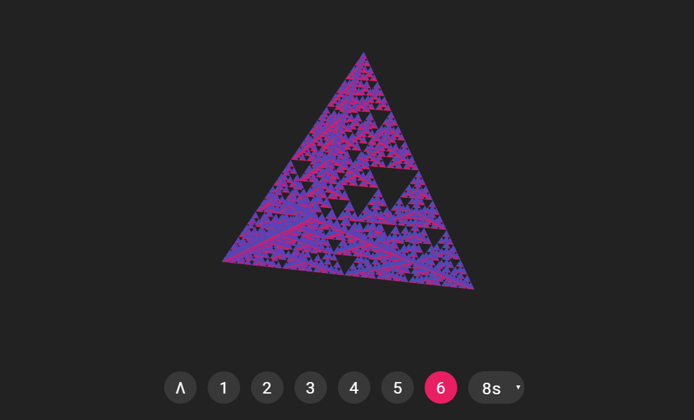

# tetrahedron

Interactive WebGL animation of a [Sierpinski tetrahedron](https://en.wikipedia.org/wiki/Sierpi%C5%84ski_triangle#Analogues_in_higher_dimensions).

The **number of iterations** (= resolution of the fractal) can be controlled via the round buttons on the bottom or by pressing the number keys <kbd>0-6</kbd>. Iteration 1 is a single tetrahedron, iteration 2 subdivides the single tetrahedron into four smaller ones. This can be repeated infinitely, but is limited to 6 for performance reasons. Iteration 0 (Λ button) is a special case, where the single tetrahedron is folded into the 2D plane.

**Animation speed** is controlled by the choice box to the right of the buttons. It sets the number of seconds for the transition from the current iteration number to any other.

You can **rotate the tetrahedron** around the vertical and horizontal axis by moving the mouse while pressing the left mouse button anywhere on screen.

## Technologies

- [npm](https://www.npmjs.com/): Handles dependencies and scripts.
- [Parcel](https://parceljs.org/): Build tool with minimal configuration.
- [Babel](https://babeljs.io/): JavaScript transpiler for latest ECMAScript features.
- [standard](https://standardjs.com/): Code style checker with minimal configuration.
- [Mocha](https://mochajs.org/): Framework for running unit tests.
- [Chai](https://www.chaijs.com): BDD style assertion library for unit tests.
- [glMatrix](http://glmatrix.net/): Javascript matrix and vector library.

## Installation

Ensure `npm` is globally installed. Then run `npm install` to install dependencies.

## Scripts

The `package.json` file defines custom scripts in the `scripts` section.

### clean

Deletes the contents of the `dist` directory.

    npm run clean

### build

Compiles the sources and writes them to the `dist` directory. The contents of `dist` can be copied directly to the web server.

    npm run build

### serve

Compiles the sources and starts a web server in the `dist` directory, usually at [localhost:1234](http://localhost:1234/).

    npm run serve

### lint

Checks code against 'standard' code style and fixes issues that can be fixed automatically.

    npm run lint

### test

Runs the unit tests specified in the `test` directory.

    npm run test

## Contact

:pencil: Lukas Eibensteiner 
:e-mail: [l.eibensteiner@gmail.com](mailto:l.eibensteiner@gmail.com) 
:package: [eibens/triangle](https://github.com/eibens/triangle)